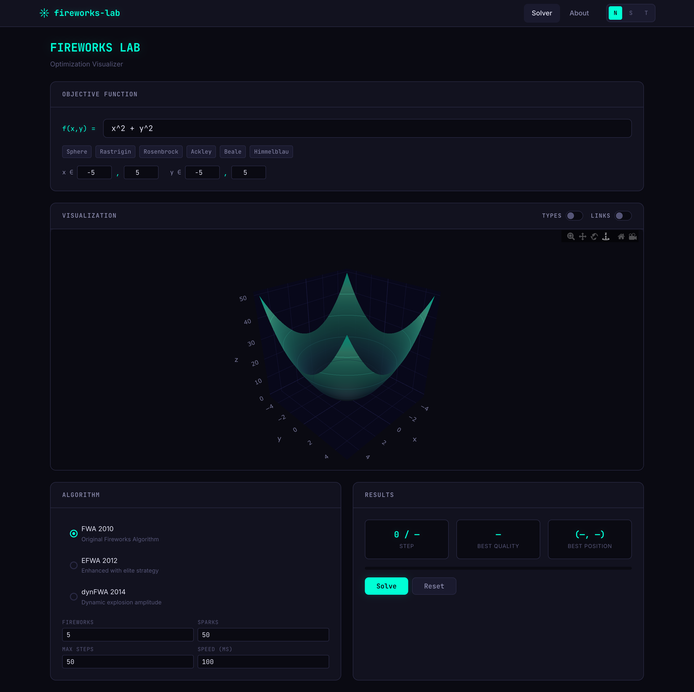
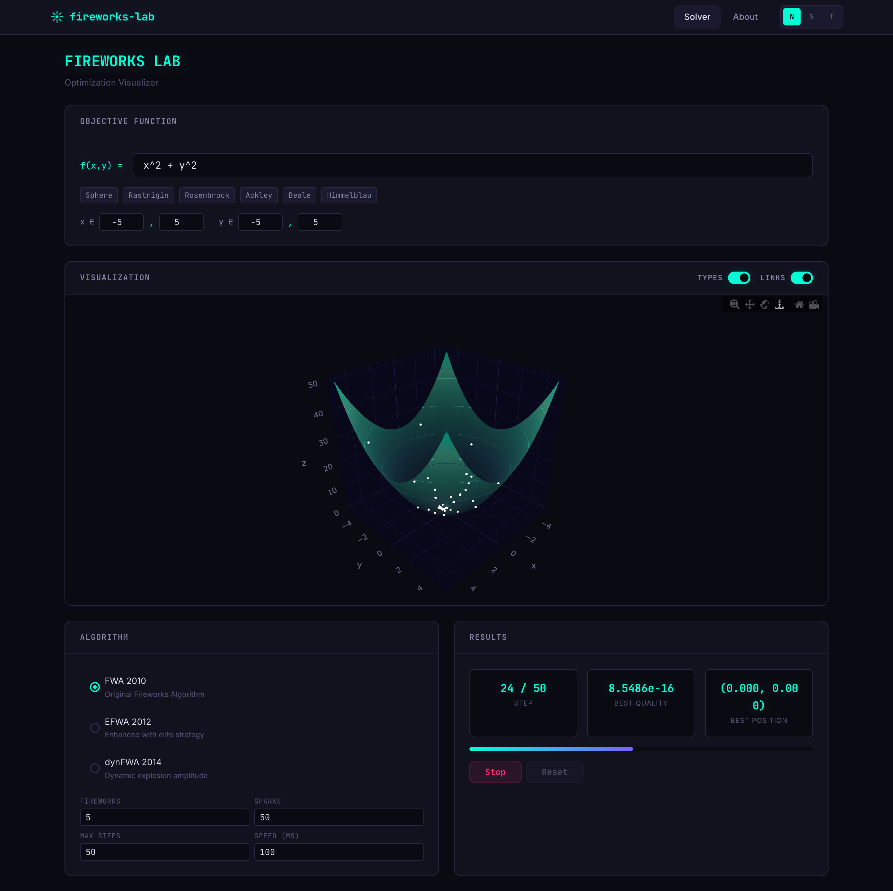
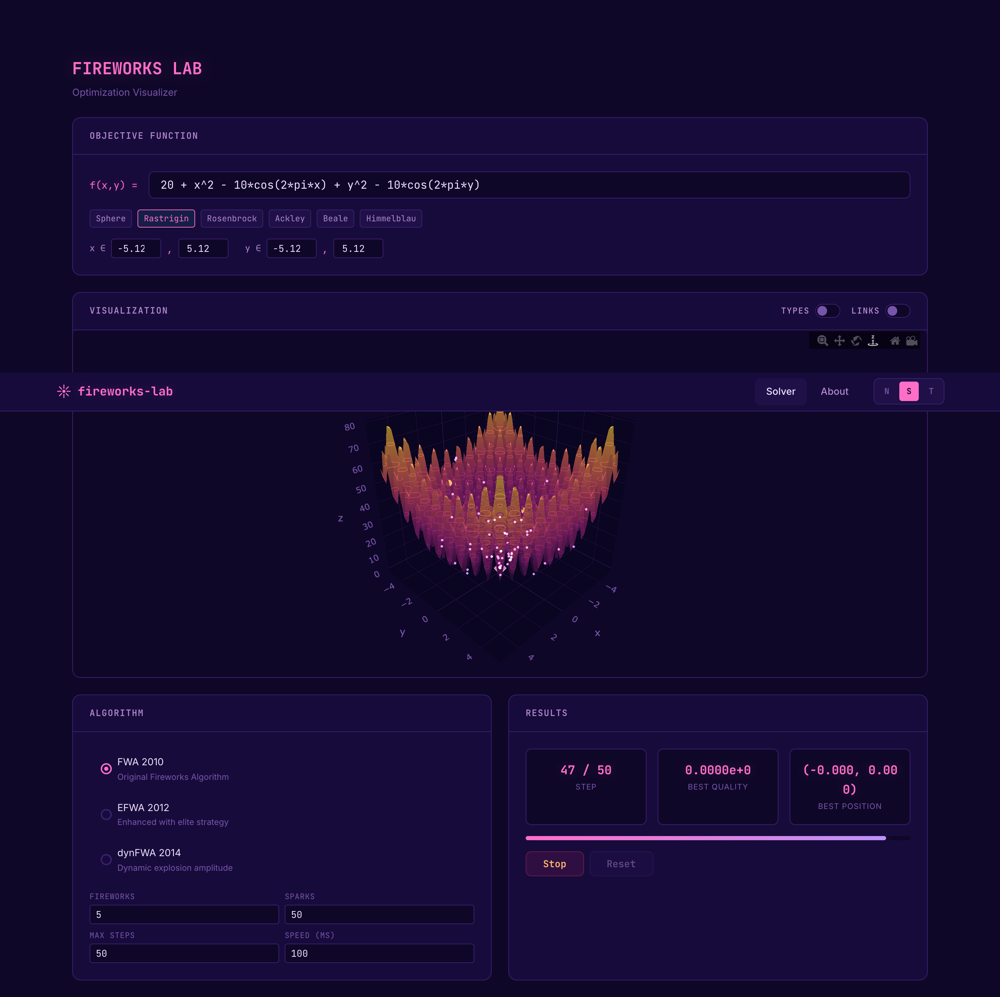
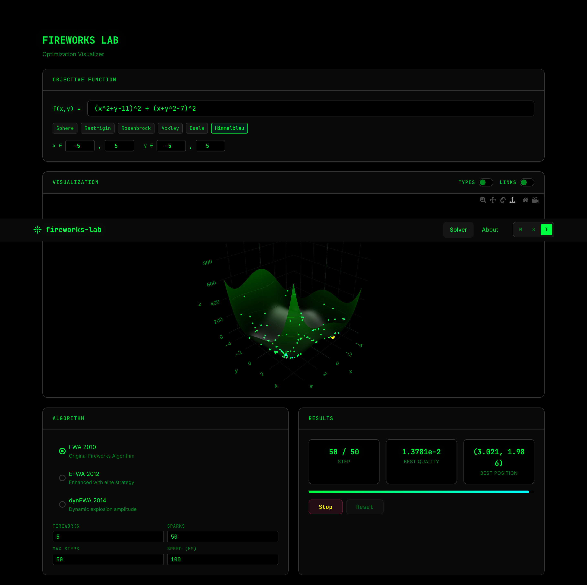

# Fireworks Lab

An interactive 3D visualization tool for the **Fireworks Algorithm (FWA)** — a swarm intelligence optimization method inspired by the explosion of fireworks. Define objective functions, configure algorithm variants, tune parameters, and watch optimization unfold in real time.

Built on top of [fireworks-ts](https://github.com/Cipher-Geist/fireworks-ts).



## Features

- **Real-time 3D surface visualization** powered by Plotly.js with interactive rotation and zoom
- **Three algorithm variants**: FWA 2010, EFWA 2012 (elite strategy), dynFWA 2014 (adaptive amplitude)
- **Six preset benchmark functions**: Sphere, Rastrigin, Rosenbrock, Ackley, Beale, Himmelblau
- **Custom formulas** — enter any `f(x, y)` expression using standard math notation
- **Visualization toggles** — differentiate fireworks from sparks by type, and show parent-child explosion links
- **Three themes**: Neon, Synthwave, Terminal
- **Configurable parameters**: firework count, spark modifier, max steps, animation speed

## Screenshots

### Neon — Solving with Types & Links enabled



### Synthwave — Rastrigin function



### Terminal — Himmelblau function



## Getting Started

### Prerequisites

- [Node.js](https://nodejs.org/) 20+
- [fireworks-ts](https://github.com/Cipher-Geist/fireworks-ts) built locally (sibling directory)

### Install & Run

```bash
nvm use 20
npm install
npm run dev
```

Open [http://localhost:5173](http://localhost:5173) in your browser.

### Build

```bash
npm run build
```

Output is written to `dist/`.

## How It Works

Each firework represents a candidate solution in the search space. During each iteration:

1. Fireworks **explode** to produce sparks (new candidate solutions)
2. Better fireworks produce more focused explosions (**exploitation**)
3. Worse fireworks produce wider explosions (**exploration**)
4. The best candidates are **selected** for the next iteration

The 3D surface plot shows the objective function landscape. Firework positions and the current best solution (diamond marker) update at each step. Enable the **Types** toggle to distinguish fireworks from sparks, and **Links** to see the parent-child explosion connections.

## Algorithm Variants

| Variant | Year | Key Innovation |
|---------|------|----------------|
| **FWA** | 2010 | Original algorithm with distance-based selection |
| **EFWA** | 2012 | Elite strategy via polynomial fitting and root-finding |
| **dynFWA** | 2014 | Adaptive explosion amplitude for a tracked core firework |

## Tech Stack

- [React](https://react.dev/) 18 + TypeScript
- [Vite](https://vite.dev/) for build tooling
- [Plotly.js](https://plotly.com/javascript/) for 3D visualization
- [math.js](https://mathjs.org/) for formula parsing
- [fireworks-ts](https://github.com/Cipher-Geist/fireworks-ts) for the optimization algorithms

## References

- Tan, Y.; Zhu, Y. *Fireworks Algorithm for Optimization*. ICSI 2010.
- Zheng, S.; Janecek, A.; Tan, Y. *Enhanced Fireworks Algorithm*. CEC 2012.
- Zheng, S.; Tan, Y. *Dynamic Search in Fireworks Algorithm*. CEC 2014.

## License

[MIT](LICENSE)
